<div align="center">

<!-- Boot sequence + glitch-reveal wordmark, generated by wordmark.sh (pyfiglet) + make_svg.py, animated as native SVG (SMIL, no JS/GIF) -->


<br/>

[](https://github.com/swokinGz)
[](https://linkedin.com/in/christiandanglades)
[](mailto:christiandanglades123@gmail.com)

<br/>


[](https://github.com/swokinGz?tab=followers)


</div>

### `// MODULE_01 :: IDENTITY.SCAN`

```
┌─[ SYSTEM DOSSIER ]───────────────────────────────────────────────┐
  DESIGNATION     : Christian Danglades
  UNIT_CLASS      : Service Desk Analyst
  DEPLOYED_AT     : Tata Consultancy Services
  ORIGIN          : Londrina, Paraná · BR  (Nacionalidade: Venezuelana)
  RUNTIME         : 3+ years — incident mgmt · troubleshooting · automation
  CURRENT_UPGRADE : Técnico em Cibersegurança (UniFil, in progress)
                    Google Cybersecurity Professional Certificate ✅
  LANGUAGE_PACKS  : ES [advanced] · PT [advanced] · EN [intermediate]
  PERFORMANCE     : 92% FCR · High CSAT · Monthly recognition
└────────────────────────────────────────────────────────────────┘
```

Analista de Service Desk trilíngue con base sólida en ITSM/ITIL, Linux, redes y fundamentos de seguridad. Construye agentes de IA (Copilot) para automatizar tareas repetitivas y reducir tiempos de resolución.

`>> TARGET_ROLES` : **IT Support (N2)** · **IT Infrastructure** · **Junior Cybersecurity** · **AI Automation**

---

### `// MODULE_02 :: CORE_STACK`

<div align="center">


<br/>


</div>

---

### `// MODULE_03 :: TELEMETRY`

<div align="center">


<br/>


<br/>


</div>

---

### `// MODULE_04 :: DEPLOYED_UNITS`

<div align="center">

<a href="https://github.com/swokinGz/ChrisCyberSec-Portfolio">
  
</a>

</div>

---

### `// MODULE_05 :: UPLINK`

<div align="center">

[](https://linkedin.com/in/christiandanglades)
[](mailto:christiandanglades123@gmail.com)

<br/>

`>> END_OF_TRANSMISSION_` 

</div>
